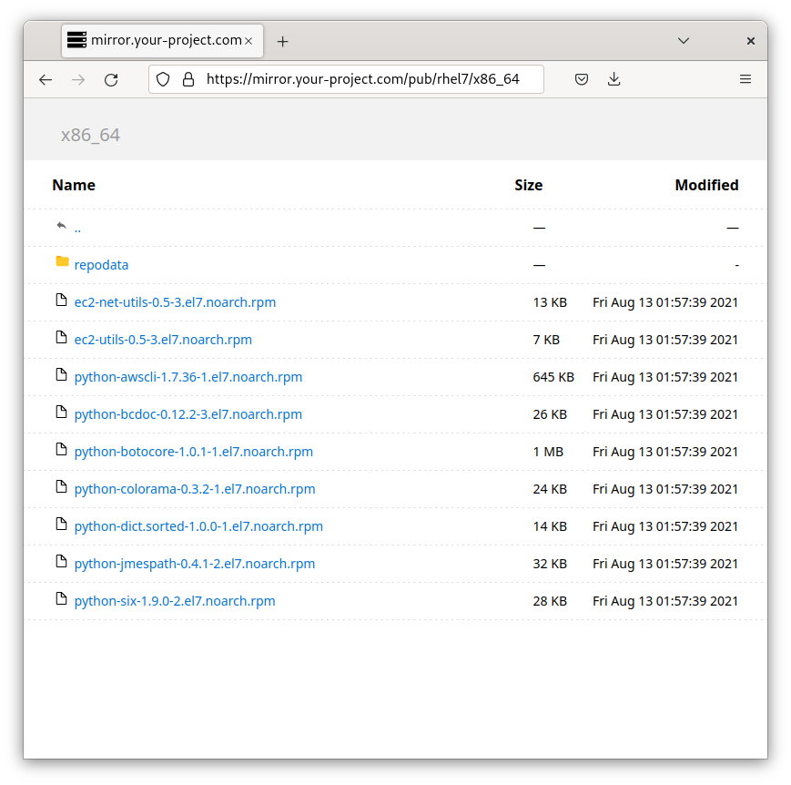

# aws-s3-web-browser-file-listing

## Overview
Want to turn your AWS S3 bucket into a highly scalable, easy to web browse, file server? This project does just that with no operational overhead (i.e. no servers to manage).

It's a common problem: 
1. You have an S3 bucket and want to host files from it. Easy!
2. You want your users to be able to navigate the directory structure in a web browser and download files, similar to a traditional "Apache Directory Listing". Harder!

Benefits of this project's approach:
- Completely serverless.
- Simple / static client browser content:
  - No Ajax or third party libraries to worry about.
  - No browser compatibility worries.
- All backing systems are native AWS components. 
- You never share credentials or rely on 3rd party services. 
- The S3 bucket remains private - allowing you to only expose parts of the bucket.
- A custom hostname / SSL certificate can be established (e.g. https://files.yourproject.com/).
- Some or all of the host files can be protected behind Basic Auth username/password.
- An AWS WebACL can be configured to prevent abusive access to the service.

## Setup
1. Create the CloudFormation stack by uploading [dist/aws-s3-browser-file-listing.cf.yaml](dist/aws-s3-browser-file-listing.cf.yaml). The parameter to this formation is the name of the S3 bucket to create.
2. Create several new files in the resulting new S3 bucket (or copy the content of [s3-bucket-bootstrap](s3-bucket-bootstrap)) into the root of the bucket:
   1. `favicon.ico` (root of s3) to act as the web browser icon for the file server.
   2. `404.html` (root of s3) to provide the user 404 / file not found webpage content (see resulting distribution "Error Pages" configuration).
   3. Upload at least file with the prefix `pub/`. For example, '/pub/README'. With this project, a "directory" will not exist until it contains a file.
3. Enter the domain of the distribution into your web browser (see DistributionDomain in output). 
4. Optional. If you wish to set up basic auth for non-pub/ content, create an AWS Secrets Manager secret with the name `${S3Bucket}-basic-auth/accounts` where `${S3Bucket}` is the name of the backing S3 bucket created for the deployment. Keys are usernames and passwords are values. 

## FAQ
Q: How can I set up a custom domain name?
A: [Configure the CloudFront distribution with a custom domain & certificate](https://docs.aws.amazon.com/AmazonCloudFront/latest/DeveloperGuide/CNAMEs.html).

Q: How do I set MIME types for my files?
A: Set the `content-type` when [uploading content to S3](https://docs.aws.amazon.com/AmazonCloudFront/latest/DeveloperGuide/AddingObjects.html)

Q: How do I prevent CloudFront from caching certain directories / file types?
A: Create a new behavior for the distribution which matches a pattern (e.g. `*/repomd.xml`). Exactly duplicate the lambdas used in the default behavior but disable all caching.

Q: I get an error when I try to access a directory or file that is not present. How do I make that a friendly message?
A: Populate a 404.html in the root of the S3 bucket. This is configured in the "Error Pages" configuration of the CloudFront distribution.

Q: How do I set up username/password based authentication for certain areas of the file server?
A: Anything under `pub/` in the S3 bucket will be accessible without authentication. If you want to establish, for example, `private/` in the S3 bucket, the lambda will require a basic auth header from the user. To establish valid usernames & passwords, populate a new secret (type 'other') in AWS Secrets Manager with the name `${S3Bucket}-basic-auth/accounts` where `${S3Bucket}` is the name of the backing S3 bucket created for the deployment. 

Q: How can I change the styling of the directory listing?
A: The HTML/CSS is inlined within [src/s3-get-index-html-gen-lambda.py](src/s3-get-index-html-gen-lambda.py). Update the content and run `./build.py` in the root of the repo. [dist/aws-s3-browser-file-listing.cf.yaml](dist/aws-s3-browser-file-listing.cf.yaml) will be updated with the result.

Q: How can I modify the behaviors in my CloudFront distribution via CloudFormations?
A: [src/aws-s3-browser-file-listing.cf-template.yaml](src/aws-s3-browser-file-listing.cf-template.yaml) serves as the basis for the CloudFormation template. Update it and run `./build.py` in the root of the repo. [dist/aws-s3-browser-file-listing.cf.yaml](dist/aws-s3-browser-file-listing.cf.yaml) will be updated with the result.

## Architecture
In short, this project uses Lambda@Edge scripts, configured as [AWS CloudFront](https://aws.amazon.com/cloudfront/) [Event functions](https://docs.aws.amazon.com/AmazonCloudFront/latest/DeveloperGuide/lambda-cloudfront-trigger-events.html), to render and return an HTML-based directory listings back to a client web browser. 

Browsing a directory:
1. A client makes a request to the CloudFront domain. In this example, we will use `xxxxxxxxxxxx.cloudfront.net/pub/`.
2. A behavior is configured in the CloudFront deployment to run a Lambda@Edge function each time a URL with path `*/` is requested (i.e. a directory vs a filename). `pub/` matches this pattern and the Lambda@Edge will be synchronously invoked to handle the incoming request.
3. The Lambda function will query the backing S3 bucket to determine the contents of the "directory" (actually an S3 prefix since S3 does not have a directory hierarchy).
4. Objects with the prefix and "sub-directories" of the prefix are used to dynamically generate an HTML file (the file listing).
5. The HTML is returned to the client and the user receives a visualization of the files / sub-directories in the directory they are browsing.

Downloading a file:
1. A client makes a request to the CloudFront domain. In this example, we will use `xxxxxxxxxxxx.cloudfront.net/pub/README`.
2. The URL path does not match the directory listing behavior (`*/`) and the request passes straight through to CloudFront which serves the file from S3 or its caches.

## Alternatives
- Using dynamic JavaScript to query public bucket APIs: https://github.com/qoomon/aws-s3-bucket-browser .
- Using a paid service (or one which uses a running server). e.g. https://www.filestash.app .

## Attribution
Thanks to [github.com/glowinthedark](https://gist.github.com/glowinthedark/625eb4caeca12c5aa52778a3b4b0adb4/d245a5c53e935f03b08e528f0b79c66e58823987) for their work on statically generating index HTML files from local directory structures. This project served as the starting point for the index generation from S3.
